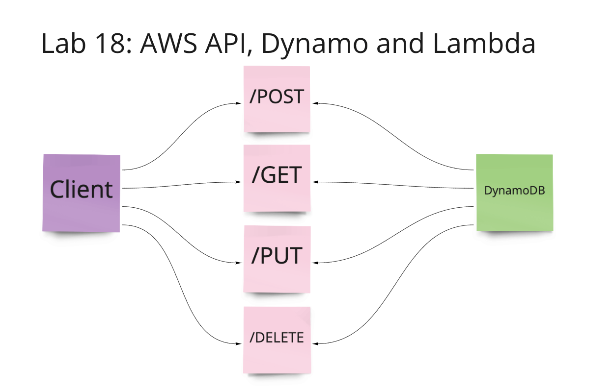

# Code 401: Advanced Software Development in Full-Stack Javascript:

## Lab 18: AWS API, Dynamo and Lambda

NOT COMPLETE - Got stuck on my delete route. It was saying it was working in the AWS test, and then not actually deleting the user when running delete and get through Swagger. And now it's returning an error code of 500 in the AWS test. So here is where I table it for the night. Update and delete routes are working.

## [Github Pull Request](https://github.com/nickibaldwin/serverless-api/pull/1)

## [AWS URL to API - broken](https://rmz3fj0mph.execute-api.us-west-2.amazonaws.com/)

## Resources

[AWS Documents](https://docs.aws.amazon.com/lambda/latest/dg/with-s3-example.html)

[Dynamoose Documents](https://dynamoosejs.com/guide/Document/#documentdeletecallback)
